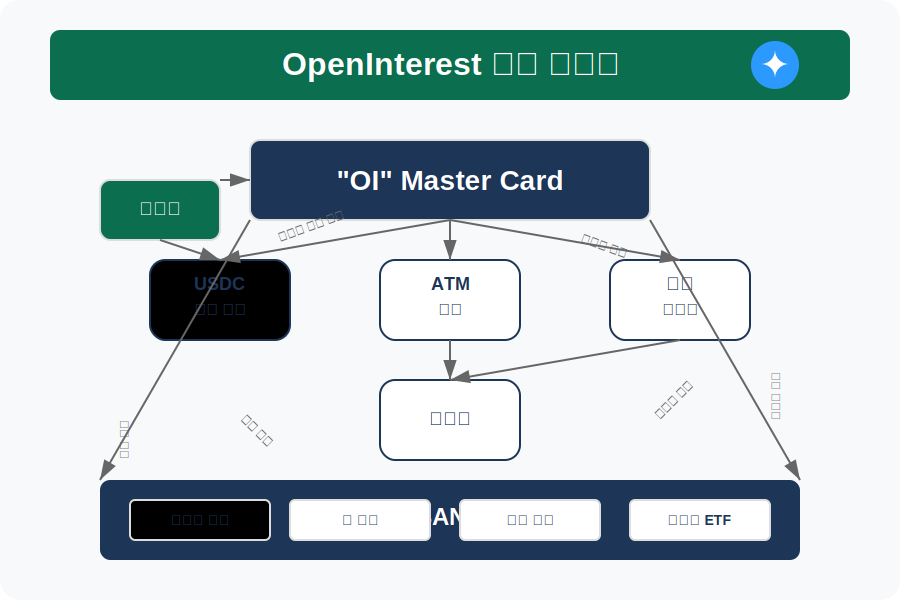

# OpenInterest 사업 구조도

OpenInterest의 비즈니스 모델과 핵심 구성 요소를 시각적으로 표현한 구조도입니다.

## 구조도 설명

### 핵심 구성 요소

1. **"OI" Master Card** - 서비스의 중심이 되는 마스터카드
2. **예금자** - 서비스의 사용자
3. **기능 요소들**:
   - **USDC 추가 이자** - 미국채 기반 이자 수익 제공
   - **ATM 출금** - 현금 출금 기능
   - **결제 솔루션** - 글로벌 결제 시스템
   - **레퍼럴** - 사용자 추천 및 수익 공유 시스템

4. **BANK** - 금융 서비스 통합 플랫폼
   - 크립토 월렛
   - 금 월렛
   - 오일 월렛
   - 블랙락 ETF

## 개선된 점

기존 다이어그램과 비교하여 다음과 같은 개선점이 있습니다:

1. **직관적인 배치** - 구성 요소들을 논리적 흐름에 따라 배치
2. **시각적 명확성** - 색상 대비와 아이콘으로 이해도 증가
3. **연결 관계 명확화** - 화살표와 설명 텍스트로 관계 명시
4. **현대적 디자인** - 깔끔한 모서리와 색상 조합으로 가독성 향상

## 라이센스

이 시각화 자료는 오픈소스로 제공됩니다.
